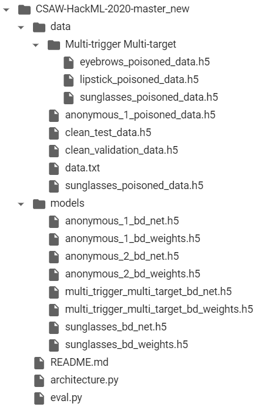

# ML-security

This repository contains code files for ECE-GY 9163 Machine Learning for Cybersecurity.

Steps to run our code:

* Our approach is RAM intensive because it generates 50 perturbations for every input image. We recommend using less than a 1000 clean images.
 
* Also, our approach takes 3 inputs, the badnet model, clean validation set, and test image.

<h3> Evaluate our model by running: %run -i eval_code.py    clean_validation_data.h5    bad_net   test_img.png</h3>

* The file 'final_code.ipynb' shows the implementation of our approach on Google Colab. 
* Create a directory with the name 'CSAW-HackML-2020-master_new' in google drive 
* Upload the datasets and the models to google drive in appropriate directories as shown.

  
  

